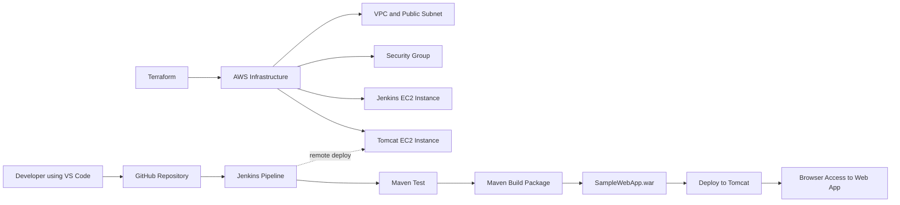
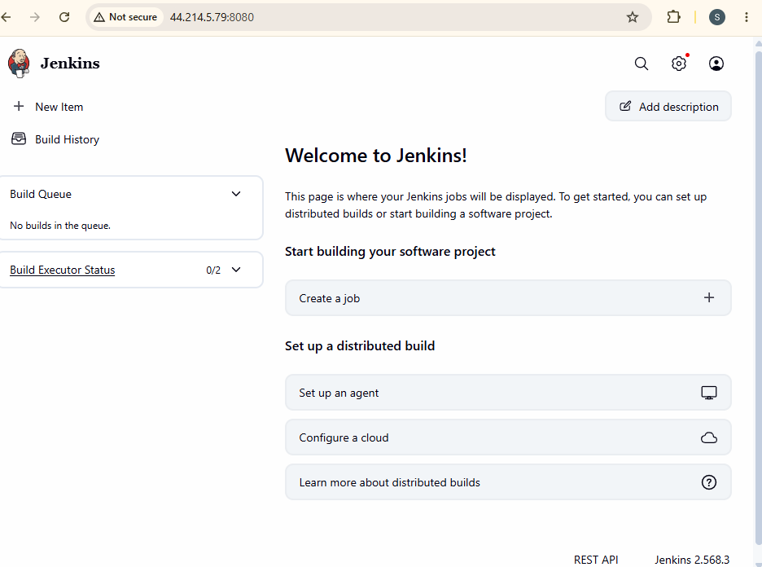
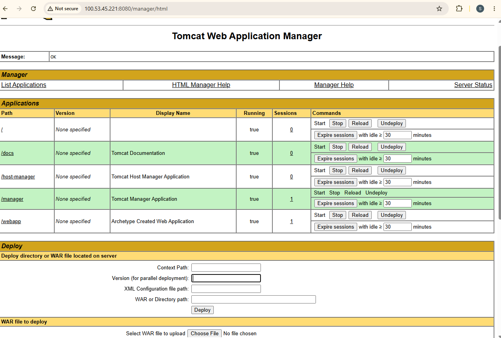
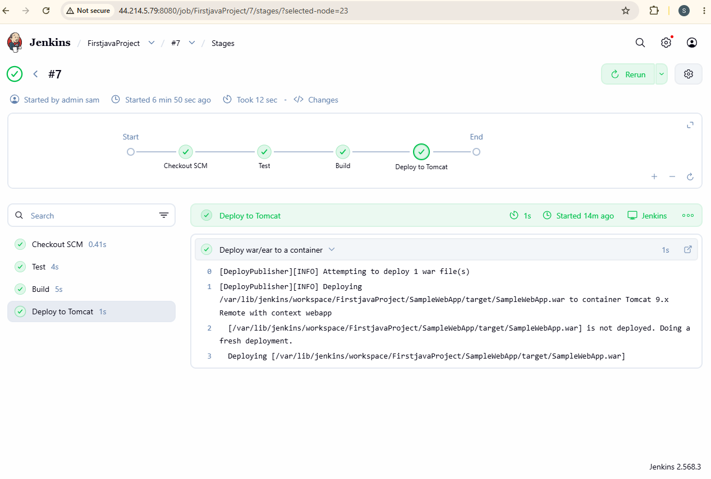
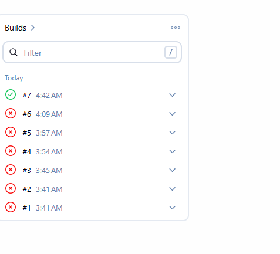

# Java Tomcat Jenkins Terraform CI/CD Pipeline on AWS

This project is a DevOps CI/CD case study that shows how I deployed a Java Maven web application to Apache Tomcat using Jenkins automation and AWS infrastructure provisioned with Terraform.

The goal was to move beyond manually copying application files to a server. I wanted a repeatable workflow where infrastructure is created with code, Jenkins pulls the application from GitHub, Maven builds a deployable WAR file, and Jenkins deploys that WAR file to a remote Tomcat server.

This project also includes the troubleshooting process. The final pipeline worked, but I had to debug Terraform credentials, SSH key permissions, Jenkins installation, Maven WAR plugin compatibility, Jenkinsfile syntax, Tomcat users, and deployment credentials before the full workflow succeeded.

## Project Objective

The objective of this project was to build a simple but realistic CI/CD workflow for a Java web application.

The project needed to:

- Provision AWS infrastructure with Terraform.
- Create a Jenkins server and a Tomcat server on EC2.
- Install Jenkins, Java, Git, and Maven.
- Install and configure Apache Tomcat.
- Pull source code from GitHub.
- Build the Java web application with Maven.
- Generate a `.war` file.
- Deploy the WAR file to Tomcat automatically.
- Use screenshots and logs to document the full implementation and troubleshooting process.

## Architecture



## How the Project Works

Terraform provisions the AWS infrastructure first. It creates the network resources, security group, Jenkins EC2 instance, and Tomcat EC2 instance. The Jenkins server is responsible for automation, while the Tomcat server is responsible for hosting the deployed Java application.

After the infrastructure is available, Jenkins is configured with a pipeline job that reads the `Jenkinsfile` from GitHub. The pipeline enters the `SampleWebApp` directory, runs Maven tests, packages the project as a WAR file, and deploys that WAR file to the Tomcat server using the Jenkins Deploy to container plugin.

At the end of the pipeline, the Java web application is available in the browser through Tomcat at the configured context path.

## Tools and Technologies

| Tool | Purpose |
|---|---|
| AWS EC2 | Hosted the Jenkins and Tomcat servers |
| Terraform | Provisioned cloud infrastructure as code |
| Jenkins | Automated build and deployment |
| Maven | Built and packaged the Java web application |
| Java | Required runtime for Maven and the web application |
| Apache Tomcat 9 | Hosted the deployed WAR file |
| GitHub | Stored the source code and Jenkinsfile |
| Git Bash / PowerShell | Used for Git, SSH, and Terraform commands |
| VS Code | Used to edit project files |

## Repository Structure

```text
.
├── SampleWebApp/
│   ├── pom.xml
│   └── src/main/webapp/
├── images/
│   ├── jenkins-dashboard.png
│   ├── jenkins-failed-builds.png
│   ├── jenkins-success-pipeline.png
│   ├── tomcat-homepage.png
│   ├── tomcat-manager.png
│   └── tomcat-deployed-app.png
├── install_jenkins.sh
├── installation.txt
├── Jenkinsfile
├── main.tf
└── README.md
```

## Infrastructure Provisioning with Terraform

Terraform was used to provision the AWS resources required for the deployment.

The `main.tf` file creates:

- A custom VPC.
- A public subnet.
- An internet gateway.
- A route table.
- A route table association.
- A security group.
- A Jenkins EC2 instance.
- A Tomcat EC2 instance.
- Output URLs for Jenkins and Tomcat.

The Jenkins EC2 instance used `install_jenkins.sh` as user data so Jenkins and its dependencies could be installed during server startup. The Tomcat EC2 instance used a Tomcat installation script so the application server could be prepared for deployment.

### Security Group Ports

| Port | Purpose |
|---:|---|
| 22 | SSH access to the EC2 instances |
| 80 | HTTP traffic |
| 443 | HTTPS traffic |
| 8080 | Jenkins web UI and Tomcat web access |

## Jenkins Server Role

The Jenkins server acted as the automation engine for the project.

It was responsible for:

- Pulling the project from GitHub.
- Running the Jenkins pipeline.
- Executing Maven commands.
- Building the WAR file.
- Connecting to the Tomcat manager endpoint.
- Deploying the WAR file to the Tomcat server.



## Tomcat Server Role

The Tomcat server acted as the runtime server for the Java web application.

It was responsible for:

- Running Apache Tomcat 9.
- Exposing the Tomcat web interface on port `8080`.
- Providing the Tomcat Manager application.
- Receiving remote deployments from Jenkins.
- Hosting the deployed application under the `/webapp` context path.




## Jenkins Pipeline

The Jenkins pipeline is defined in the `Jenkinsfile`. It contains three main stages: test, build, and deploy.

```groovy
pipeline {
    agent any

    stages {
        stage('Test') {
            steps {
                sh 'cd SampleWebApp && mvn test'
            }
        }

        stage('Build') {
            steps {
                sh 'cd SampleWebApp && mvn clean package'
            }
        }

        stage('Deploy to Tomcat') {
            steps {
                deploy adapters: [
                    tomcat9(
                        credentialsId: 'tomcat-admin',
                        path: '',
                        url: 'http://TOMCAT_PUBLIC_IP:8080/'
                    )
                ],
                contextPath: 'webapp',
                war: 'SampleWebApp/target/SampleWebApp.war'
            }
        }
    }
}
```

## Pipeline Stage Explanation

### 1. Test Stage

The pipeline first changes into the `SampleWebApp` directory and runs Maven tests.

```bash
cd SampleWebApp && mvn test
```

This verifies that the Maven project can be read correctly and that any available tests can run before packaging.

### 2. Build Stage

The build stage packages the Java web application into a WAR file.

```bash
cd SampleWebApp && mvn clean package
```

The final artifact is created at:

```text
SampleWebApp/target/SampleWebApp.war
```

### 3. Deploy to Tomcat Stage

The deploy stage sends the generated WAR file from Jenkins to the Tomcat server.

Jenkins uses:

- Tomcat server URL.
- Jenkins credential ID `tomcat-admin`.
- Tomcat manager endpoint.
- WAR file path.
- Context path `webapp`.

After deployment, the application becomes available at:

```text
http://TOMCAT_PUBLIC_IP:8080/webapp
```




## Maven Configuration

The Java web application is a Maven WAR project. The `pom.xml` defines the project packaging as `war` and configures the final artifact name as `SampleWebApp`.

A newer Maven WAR plugin version was added to avoid compatibility issues with the default older plugin.

```xml
<build>
  <finalName>SampleWebApp</finalName>
  <plugins>
    <plugin>
      <groupId>org.apache.maven.plugins</groupId>
      <artifactId>maven-war-plugin</artifactId>
      <version>3.4.0</version>
    </plugin>
  </plugins>
</build>
```

## Tomcat Configuration for Remote Deployment

To allow Jenkins to deploy remotely, Tomcat needed a user with the correct manager roles.

The file edited on the Tomcat server was:

```bash
/etc/tomcat9/tomcat-users.xml
```

The active user configuration looked like this:

```xml
<role rolename="manager-gui"/>
<role rolename="manager-script"/>
<role rolename="admin-gui"/>
<user username="admin" password="REPLACE_WITH_SECURE_PASSWORD" roles="manager-gui,manager-script,admin-gui"/>
```

After updating the file, Tomcat was restarted:

```bash
sudo systemctl restart tomcat9
```

The same username and password were then added in Jenkins credentials using the ID:

```text
tomcat-admin
```

## Final Result

The final pipeline completed successfully. Jenkins pulled the code from GitHub, ran Maven tests, packaged the application, and deployed the WAR file to Tomcat.

The successful workflow was:

```text
GitHub source code
      ↓
Jenkins pipeline
      ↓
Maven test
      ↓
Maven package
      ↓
SampleWebApp.war
      ↓
Tomcat deployment
      ↓
Browser access
```

## Challenges, Errors, and Fixes

This project involved a lot of troubleshooting. The final success came from solving each error one at a time.

### 1. AWS Credentials Error

**Problem:** Terraform failed with this error:

```text
InvalidClientTokenId: The security token included in the request is invalid
```

**Cause:** My AWS credentials were not configured correctly.

**Fix:** I reconfigured AWS credentials and verified the identity.

```bash
aws configure
aws sts get-caller-identity
```

### 2. EC2 Availability Zone Error

**Problem:** Terraform failed because the selected instance type was not available in one Availability Zone.

**Cause:** The EC2 instance type was not supported in the selected AZ.

**Fix:** I selected a supported Availability Zone.

```hcl
availability_zone = "us-east-2a"
```

### 3. SSH Key Permission Error

**Problem:** SSH failed because the private key permissions were too open.

**Cause:** SSH requires private keys to have restricted permissions.

**Fix:** I adjusted the key permissions on Windows using `icacls`, then connected again with SSH.

### 4. Jenkins Installation Issue

**Problem:** Jenkins did not install correctly at first.

**Cause:** The installation script and package setup needed corrections.

**Fix:** I checked Jenkins status, updated the installation commands, and restarted Jenkins.

```bash
sudo systemctl status jenkins
sudo systemctl restart jenkins
```

### 5. Jenkins GPG Key Error

**Problem:** Jenkins installation failed with a missing public key error.

```text
NO_PUBKEY 7198F4B714ABFC68
```

**Cause:** The Jenkins repository signing key was missing or outdated.

**Fix:** I updated the Jenkins repository signing key and reran the installation.

### 6. Maven WAR Plugin Error

**Problem:** Jenkins failed during the Maven package stage.

```text
maven-war-plugin:2.2
Cannot access defaults field of Properties
```

**Cause:** Maven was using an old WAR plugin version that was not compatible with the Java/Maven environment.

**Fix:** I added `maven-war-plugin` version `3.4.0` to `pom.xml`.

### 7. Malformed POM Error

**Problem:** After editing `pom.xml`, Maven failed with a malformed POM error.

**Cause:** A `<build>` section was accidentally nested inside another `<build>` section.

**Fix:** I corrected the XML structure so there was only one valid `<build>` block.

### 8. Jenkinsfile Command Error

**Problem:** The original Jenkins command was written like this:

```bash
cd SampleWebApp mvn test
```

**Cause:** `cd` and `mvn` were combined incorrectly.

**Fix:** I used `&&` to run Maven only after entering the correct directory.

```bash
cd SampleWebApp && mvn test
```

### 9. Maven Ran from the Wrong Directory

**Problem:** Running Maven from the root infrastructure directory caused this error:

```text
The goal you specified requires a project to execute but there is no POM in this directory
```

**Cause:** Maven must be run from the directory containing `pom.xml`.

**Fix:** I ran Maven inside the `SampleWebApp` folder.

```bash
cd SampleWebApp
mvn clean package
```

### 10. Git Commit Identity Error

**Problem:** Git would not allow a commit because username and email were not configured.

**Cause:** Git did not know the author identity.

**Fix:** I configured Git identity.

```bash
git config --global user.name "Your Name"
git config --global user.email "you@example.com"
```

### 11. Tomcat User Was Commented Out

**Problem:** Tomcat login did not work even though sample users appeared in `tomcat-users.xml`.

**Cause:** The sample users were inside an XML comment, so Tomcat ignored them.

**Fix:** I added active roles and a real user before `</tomcat-users>`.

### 12. Jenkins Could Not Deploy to Tomcat

**Problem:** Jenkins could build the WAR file but could not deploy it.

**Cause:** Tomcat did not have the right manager user and Jenkins did not have matching credentials.

**Fix:** I added a Tomcat user with the `manager-script` role and created a Jenkins credential with ID `tomcat-admin`.

### 13. Stage View Confusion

**Problem:** The build succeeded, but I was not seeing the classic stage view at first.

**Cause:** Jenkins UI version and view location were different from examples I had seen.

**Fix:** I used the Jenkins pipeline stages page to verify each stage result.



## Screenshot Evidence

| Evidence | Screenshot |
|---|---|
| Jenkins dashboard |  |
| Failed builds during troubleshooting |  |
| Successful Jenkins pipeline |  |
| Tomcat homepage |  |
| Tomcat manager |  |
| Deployed web application |  |

## What I Learned

Through this project, I learned how to:

- Provision AWS infrastructure using Terraform.
- Build a custom VPC, subnet, route table, internet gateway, and security group.
- Use EC2 user data scripts to install Jenkins and Tomcat.
- Configure Jenkins to pull a pipeline from GitHub.
- Build a Java Maven web application into a WAR file.
- Fix Maven plugin compatibility issues.
- Configure Tomcat users and roles for remote deployment.
- Store deployment credentials in Jenkins.
- Read Jenkins console output to identify the exact failure stage.
- Debug cloud, Linux, Jenkins, Maven, Git, and Tomcat issues step by step.

## Security and Cost Notes

This was a learning project. The EC2 instances were temporary lab resources and should be destroyed when not in use to avoid AWS charges.

For production, I would improve the setup by:

- Restricting SSH and web access to trusted IP addresses.
- Using HTTPS instead of plain HTTP.
- Using a remote backend for Terraform state.
- Storing secrets in AWS Secrets Manager or Jenkins credentials only.
- Avoiding hardcoded public IP addresses in the Jenkinsfile.
- Using separate security groups for Jenkins and Tomcat.
- Adding a load balancer and custom domain name.
- Using Jenkins agents instead of running builds on the controller.

## Project Status

Completed successfully.

The final CI/CD pipeline provisioned infrastructure, built the Java web application, generated a WAR file, and deployed it to Apache Tomcat automatically through Jenkins.
